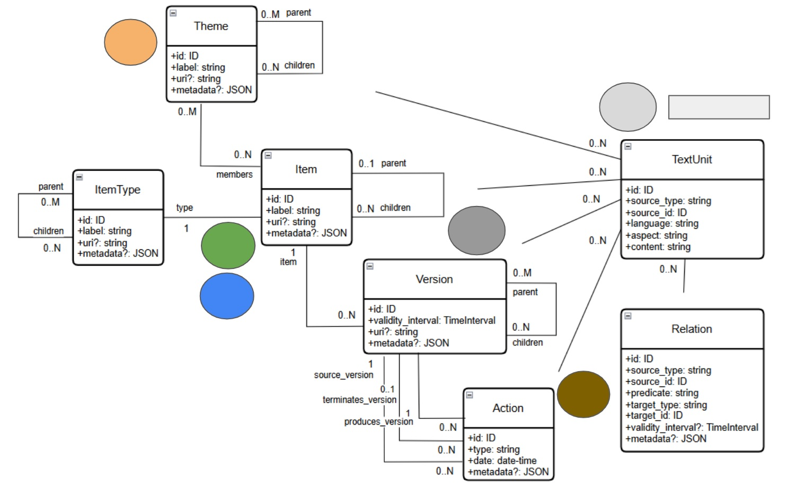

# SAT-Graph API Specification

[](https://opensource.org/licenses/MIT)
[](./specification/openapi.yaml)

This repository contains the official OpenAPI 3.x specification for the **SAT-Graph API**, a formal, auditable interface for querying the Structure-Aware Temporal Graph (SAT-Graph) RAG system.

## 📄 Academic Publication

This specification is described in the [research paper](https://arxiv.org/abs/2510.06002):

> "Deterministic Legal Retrieval: An Action API for Querying the SAT-Graph RAG." _arXiv preprint arXiv:2510.06002 (2025).

**Status:** This is a **formal specification**, not a reference implementation. The implementation is ongoing as part of the SAT-Graph ecosystem.

### Related Work

This API builds upon:

- **[SAT-Graph RAG](https://arxiv.org/abs/2505.00039)** - The knowledge graph substrate
- **[LRMoo Ontology](https://arxiv.org/abs/2506.07853)** - Temporal modeling framework for legal resources

## The Problem: The Limits of Standard RAG in Structured Domains

Standard Retrieval-Augmented Generation (RAG) systems, while powerful, treat complex documents as a "flat-text" collection. This approach fails in high-stakes, structured domains like law, leading to critical errors:

- **Temporal Naivety:** Standard RAG cannot distinguish between a law's current version and its outdated historical versions, making point-in-time analysis impossible.
- **Context Blindness:** It is unaware of the rigid hierarchical structure of a document (e.g., a Chapter's relationship to an Article), losing essential context.
- **Causal Opacity:** It cannot trace the legislative events (e.g., an amendment) that cause a legal norm to change over time.

## The Solution: A Two-Layer Architecture for Trustworthy AI

The SAT-Graph RAG framework addresses these challenges with a two-layer architecture:

1. **[The SAT-Graph (The Knowledge Substrate)](https://arxiv.org/abs/2505.00039):** A verifiable knowledge graph that explicitly models the hierarchy, diachronic evolution, and causal events of documents (like legal norms)--based on this [LRMoo Ontology](https://arxiv.org/abs/2506.07853).
2. **The Canonical Action API (The Interaction Protocol):** This API. It serves as the single, secure, and auditable bridge between a reasoning agent (like an LLM) and the SAT-Graph.

This repository specifies this critical second layer. Instead of a monolithic query engine, this API provides a library of **atomic, composable, and auditable actions** that serve as the fundamental building blocks for constructing reliable retrieval plans, as showed in the figure below.

### Active Retrieval: A Paradigm Shift

In traditional RAG systems (baseline), the generative AI receives context extracted from the knowledge base through a **passive semantic similarity algorithm** that matches the user's prompt against stored embeddings. This approach is fundamentally limited to surface-level text matching.

In contrast, the SAT-Graph API enables **active retrieval** through an agentic workflow:

1. A **reasoning agent** (an LLM with planning capabilities) analyzes the user's query and decomposes it into a strategic retrieval plan.
2. The agent **actively orchestrates** context gathering by making deliberate calls to the API's actions, navigating the graph's structure, temporal dimensions, and causal relationships.
3. The retrieved context—now enriched with structural, temporal, and causal information—is then passed to the **generative AI** for response synthesis.

This active strategy transforms retrieval from a passive matching process into an intelligent exploration guided by reasoning, enabling the system to answer questions that require multi-step logical inference across complex graph structures.


## Core Design Principles

The API design is guided by three principles to ensure trustworthiness:

- **1. Maximal Determinism:** We isolate probabilistic natural language interpretation at the entry points (e.g., `resolveItemReference`). Once a formal identifier (URI/URN) is obtained, all subsequent actions that operate on it are **guaranteed to be deterministic**.
- **2. Composability:** Actions are atomic "building blocks." A higher-level agent can chain them together to construct complex, flexible query workflows.
- **3. Verifiability through Auditability:** Every action returns a structured output, including confidence scores where applicable. The sequence of calls and responses forms a complete, human-readable audit trail, making the agent's entire reasoning process transparent and verifiable.

#### Core Data Models

The following diagram provides a comprehensive overview of the core data models that constitute the SAT-Graph entities and their relationships.
At the heart of this architecture is a strict separation of concerns that distinguishes the timeless structural layer from the temporal, causal, and textual layers:

* **Theme**: A classification system for discovery. Themes form a poly-hierarchical taxonomy for organizing Items by topic or subject matter.
* **ItemType**: The type taxonomy system. ItemTypes form a poly-hierarchical classification that defines the formal type system for Items (e.g., Constitution, Article, Paragraph), enabling validation, navigation, and rich metadata about structural relationships.
* **Item**: The timeless, conceptual anchor. It represents the abstract identity of any entity in the knowledge graph, from a whole document (Work) to a single paragraph (Work Component) or a concept (Concept) or a concrete entity. **Implementation Note:** While the academic paper's conceptual model includes a `children` property in the Item entity for didactic clarity, this API specification separates structural navigation into a dedicated `GET /items/{itemId}/children` endpoint to address efficiency and scalability concerns (e.g., articles with many incisos would bloat every Item response unnecessarily).
* **Version**: The temporal snapshot. Each Version represents the state and structure of an Item during a specific time interval. **Implementation Note:** While the academic paper's conceptual model includes `parent` and `children` properties for didactic clarity, this API specification provides dedicated endpoints (`GET /versions/{versionId}/parent?at={timestamp}` and `GET /versions/{versionId}/children`) to address both efficiency and correct temporal semantics. A Version can be reused by multiple parent Versions over time (e.g., an unchanged paragraph may be part of 100+ brazilian federal Constitution amendment versions), so the `parent` relationship is contextual to a specific point in time.
* **Action**: The causal engine. A first-class entity that represents the event that causes state transitions, terminating an old Version and producing a new one.
* **Relation**: 🔷 *Extended API* - Models semantic relationships between entities (e.g., citations, references, dependencies). Part of the production extensions beyond the canonical core.
* **TextUnit**: The concrete textual content. This flexible object holds the text for any entity in any language, enabling the "multi-aspect retrieval" strategy where, beyond text segments, even metadata, alternative identifiers and names, and descriptions are searchable.
* 

**Architectural Note: Unifying Hierarchical Relationships**

A core design decision of the SAT-Graph API is to provide a consistent and predictable interface for navigating all hierarchical structures. While the underlying ontology distinguishes between different semantic types of hierarchy—such as structural composition in Items and Versions (*hasPart/isPartOf*), thematic categorization in Themes (*broader/narrower*), or item type classification (*hasSubclass/isSubclassOf*)—the API deliberately abstracts these into a single, unified pair of properties: `parent` and `children`.

This pragmatic choice simplifies client-side logic, as any tree or graph traversal can be implemented using the same consistent properties, regardless of the entity type. The specific semantic meaning of the hierarchy is implicitly defined by the context of the entity itself (e.g., for a Theme, `parent` represents a broader concept; for an Item, `parent` represents structural containment). This approach prioritizes developer experience and API consistency without sacrificing the semantic richness of the underlying model, which remains intact in the graph's native representation.

For a detailed definition of each field and property, please refer to the individual schema files in the /specification/schemas/ directory.

#### Data Scoping and Datasources

This API is designed to serve data from multiple, distinct providers in a unified manner. Each provider is referred to as a **Datasource**.

###### What is a Datasource?

A Datasource represents the system or institution where an entity (`Item`, `Theme`, etc.) originates. For example, in a legal context, datasources could include:

* `datasource_Senate`: Data curated and provided by the Federal Senate.
* `datasource_Chamber`: Data from the Chamber of Deputies.
* `datasource_SupremeCourt`: Jurisprudence data from the Supreme Federal Court.

Or it can be an internal system of each institution.

##### Access Control

Access to the API is governed by these Datasources. Each consumer's API Key is granted access to a specific set of one or more Datasources. This has two major implications for how you use the API:

1. **Implicit Filtering (Security):** Every request you make is automatically and securely filtered to only include results from the Datasources your API Key has been granted. It is impossible to access data from a Datasource you are not authorized for.
2. **Explicit Filtering (Flexibility):** For consumers with access to multiple Datasources, most endpoints include an optional `datasources` parameter. You can use this to narrow your query to a specific subset of your granted Datasources, providing more targeted results. This includes:
   - Search and discovery actions (e.g., `searchItems`, `resolveItemReference`)
   - Introspection endpoints (e.g., `getRootThemes`, `getRootItemTypes`) - useful in federated scenarios where each datasource maintains its own taxonomies
   - Batch operations (e.g., `getBatchTexts`)

#### Authentication

All endpoints in this API are protected and require authentication. You must include a valid API Key in the `Authorization` header of every request.

Requests made without a valid API Key will fail with a `401 Unauthorized` status code.

**Header Format:**
Authorization: YOUR_API_KEY

## 📚 Documentation

### Quick Links

- **📖 [Technical Specification Documentation](./specification/README.md)** - Detailed API architecture, endpoint categories, and technical guides
- **🚀 [Getting Started Guide](./docs/getting-started.md)** - Step-by-step guide for first-time users
- **🗂️ [Action Categories](./docs/ACTION_CATEGORIES.md)** - Complete taxonomy of all API actions with workflow patterns
- **📋 [API Reference](./docs/api-reference.md)** - Complete endpoint reference documentation
- **⚠️ [Error Handling Guide](./docs/ERROR_HANDLING.md)** - HTTP status codes, error formats, and handling patterns
- **⏱️ [Temporal Resolution Guide](./docs/TEMPORAL_RESOLUTION.md)** - Understanding PointInTime vs SnapshotLast policies
- **🔧 [OpenAPI Specification](./specification/openapi.yaml)** - Main specification file

### Getting Started

The complete API specification is located in the `specification/` directory.

- **Primary Specification File:** [`specification/openapi.yaml`](./specification/openapi.yaml)
- **Detailed Documentation:** [`specification/README.md`](./specification/README.md)

### Exploring the API

You can explore the API specification using any OpenAPI 3 compatible tool.

**Note:** The specification uses a multi-file structure with `$ref` for better organization. The online Swagger Editor cannot resolve external file references.

**To use with Swagger Editor, you need a bundled single-file version:**

1. **Generate locally:**

   ```bash
   cd specification
   npm install
   npm run bundle
   ```

   Upload the generated `openapi-bundled.yaml` to Swagger Editor.
2. **Download from GitHub Releases** (recommended for end users):

   - Each release includes a pre-generated `openapi-bundled.yaml` file
   - No need to install Node.js or run scripts
3. **Use tools that support multi-file specs:**

   - **[Stoplight Studio](https://stoplight.io/studio/)** (Desktop app)
   - **[VS Code OpenAPI Extension](https://marketplace.visualstudio.com/items?itemName=42Crunch.vscode-openapi)**
   - **[ReDoc](https://redocly.github.io/redoc/)** with Redocly CLI

See [specification/BUNDLING.md](./specification/BUNDLING.md) for detailed instructions.

### Reusing the Specification: Generating a Client

The primary goal of this specification is to enable third-party reuse. You can automatically generate a client (SDK) for your preferred programming language using the **[OpenAPI Generator](https://openapi-generator.tech/)**.

For example, to generate a Python client:

```bash
# Make sure you have OpenAPI Generator installed
openapi-generator-cli generate -i specification/openapi.yaml -g python -o ./generated-client/python
```

This command will create a fully-typed Python package that you can use to interact with any server that implements this API specification.

## API Capabilities at a Glance

The API actions are organized into logical groups to support complex agentic workflows:

- **Discovery and Search:** Probabilistic entry points for finding entities based on natural language text, semantic content, or structured filters (e.g., `resolveItemReference`, `searchTextUnits`).
- **Deterministic Fetch:** Guaranteed retrieval of full data objects using their canonical IDs (e.g., `getItem`, `getValidVersion`).
- **Structural Navigation:** Actions for traversing the atemporal document hierarchy (e.g., `getItemAncestors`, `getItemsInScope`).
- **Causal & Lineage Analysis:** Powerful actions for traversing the temporal and causal dimensions of the graph (e.g., `getItemHistory`, `traceCausality`, `summarizeImpact`).
- **Introspection:** Actions that allow an agent to discover the graph's capabilities and boundaries at runtime (e.g., `getTemporalCoverage`).

## Use Cases

This API is designed to enable agents to answer complex questions that are intractable for standard RAG, such as:

- **Point-in-Time Comparison:** "Show me the exact textual differences in Article X before and after the amendment that introduced concept Y."
- **Causal Lineage Tracing:** "Which specific law introduced the version of Article Y that was valid in 2012, and is that text still the same today?"
- **Hierarchical Impact Summarization:** "Summarize all revocations within the 'National Tax System' chapter between 2019 and 2022."

## Citing Our Work

If you use this specification or the concepts from our framework in your research, please cite our paper:

```bibtex
@article{demartim2025satgraphapi,
  author       = {Hudson de Martim},
  title        = {Deterministic Legal Retrieval: An Action API for Querying the SAT-Graph RAG},
  year         = {2025},
  eprint       = {2510.06002},
  archivePrefix= {arXiv},
  primaryClass = {cs.AI}
}
```

## Contributing

This project is currently in a specification-only phase and is not accepting contributions at this time.

## License

This project is licensed under the MIT License - see the [LICENSE](./LICENSE) file for details.
